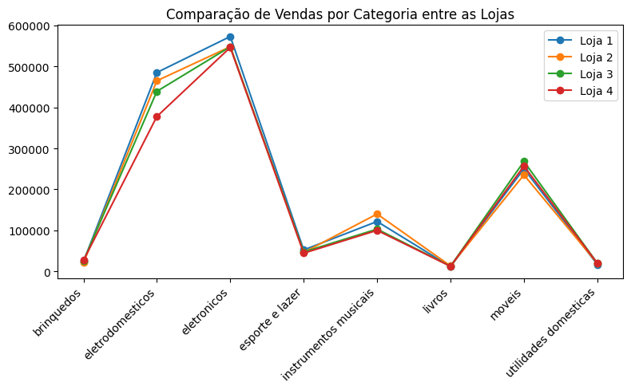

 ## 🛍 AluraStore
Este desafio teve como objetivo praticar habilidade analítica e uso de bibliotecas Python

 ## 📜 Visão geral
Realizar análise de dados de quatro lojas para que o cliente possa decidir qual delas irá vender visto a necessidade de capital para investimento em outro setor.
 - Análise do faturamento
 - Vendas por categoria
 - Média de avaliações
 - Produtos mais e menos vendidos
 - Frete médio por loja

## 🛠 Ferramentas utilizadas
 - Notebook Colab
 - Bibliotecas **panda**, **matplotlib** e **plotly**
 

# 📈 Relatório de Conclusão

## 📋 Análise do Faturamento

Nesta etapa percebemos que a loja que faturou menos foi a de número 4, apresentando uma diferença de quase 10% em comparação a loja 1 que apresentou o maior faturamento.

A diferença entre vendas da loja 1 e 4 foi de: 9.78%
* O faturamento da loja 1 foi de: R\$ 1.534.509,12
* O faturamento da loja 2 foi de: R\$ 1.488.459,06
* O faturamento da loja 3 foi de: R\$ 1.464.025,03
* O faturamento da loja 4 foi de: R\$ 1.384.497,58

## 🛒 Vendas por categoria
Ao analisar as vendas por categoria vemos que os destaques nas vendas são os seguintes:
- A loja 4 para Utilidades domésticas e Brinquedos;
- A loja 1 para eletrodomésticos;
- A loja 2 para Livros e Instrumentos Musicais;
- Loja 3 para móveis;
- A loja 4 teve o menor número de vendas na categoria Eletrônicos.

Ainda, vemos que o maior faturamento se dá nas categorias Eletrônicos e Eletrodomésticos. Por isso a Loja 4 tem o menor faturamento mesmo tendo sido líder em duas outras categorias.

## 🤩 Média de Avaliações

Na média de Avaliaçao das lojas vemos que a loja 3 fica em primeiro lugar, a loja 1 tem a pior média e a loja 4 tem a segunda pior média.

## 📦 Produtos mais e menos vendidos

Na análise das vendas por categoria a loja 2 é a que menos vende nas categorias Brinquedos, Eletrodomesticos, Esporte e Móveis. Porém é a segunda colocada em Faturamento total.

Em todas as quatro lojas os produtos mais vendidos estão nas categorias de Móveis e Eletrônicos, cada um chegando próximo de 500 itens por loja no período analisado.

## 📭 Frete médio por loja

A loja 1 apresentou maior valor médio por frete, o que caberia uma análise futura mais detalhada sobre a logística envolvida. A loja 4 apresenta o menor custo médio de frete. 

# 🎯 Conclusão

Sendo assim, recomendamos a venda da Loja 4 devido seu menor faturamento total em relação as outras lojas e baixa média de avaliação dos clientes.
